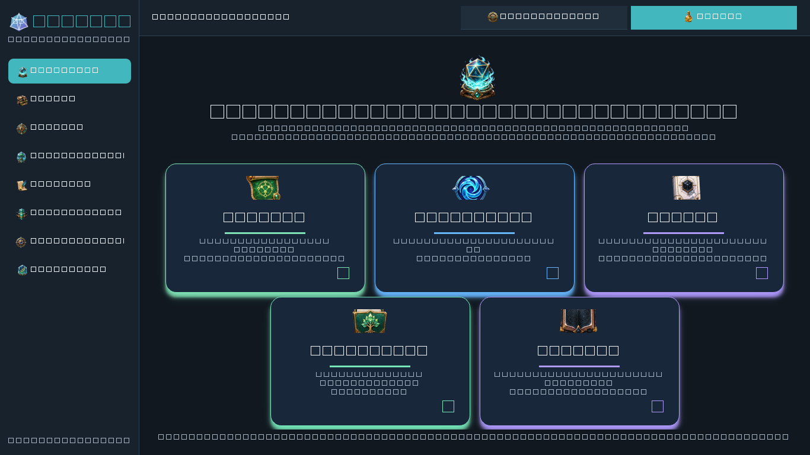
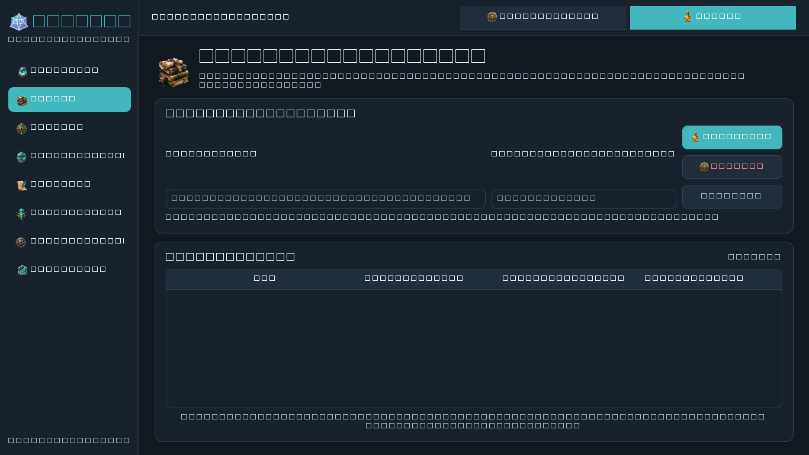
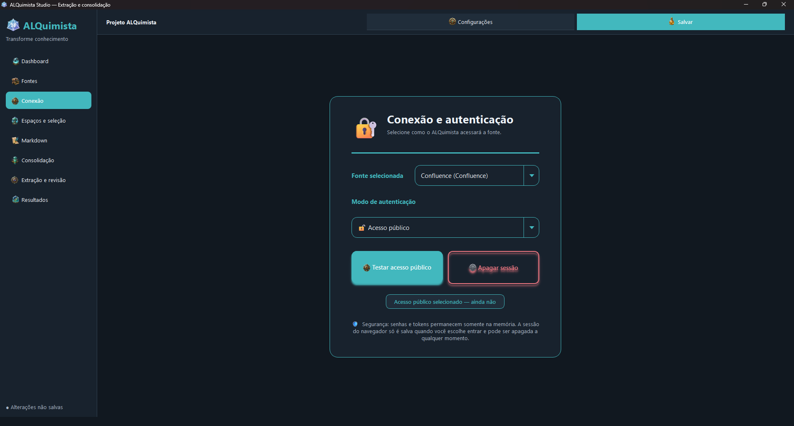
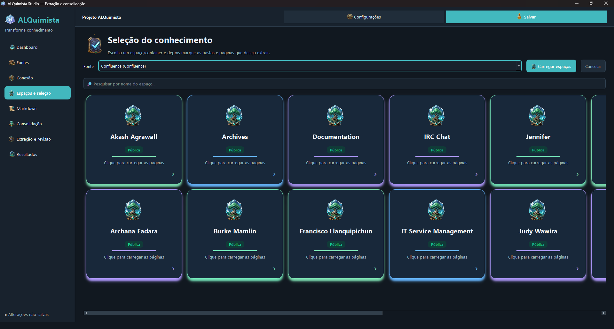
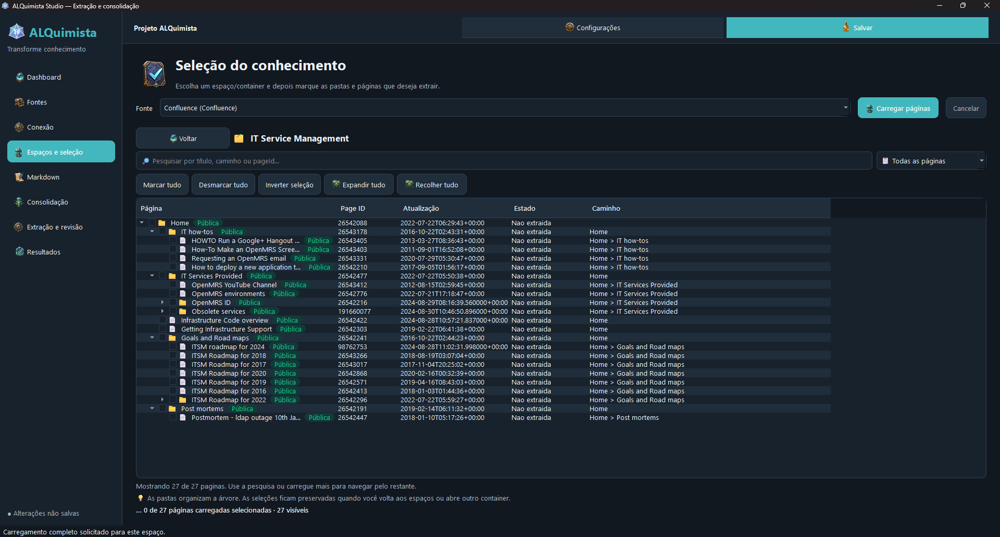
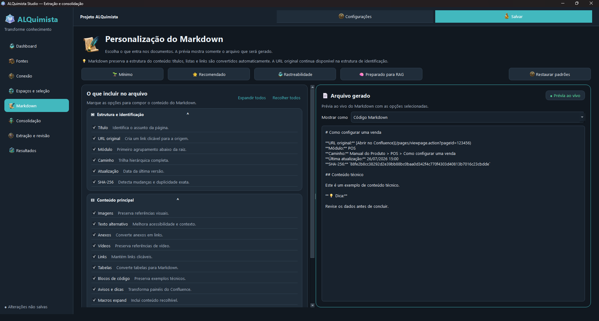
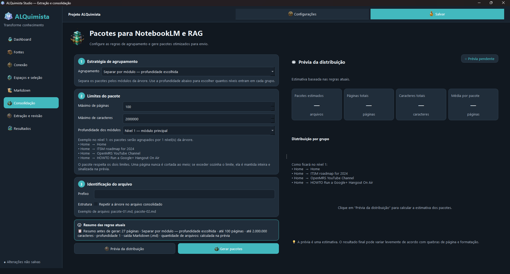
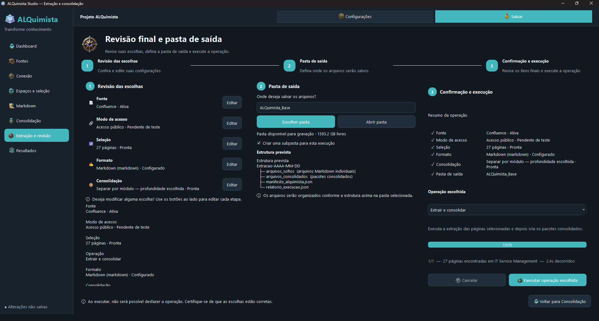

<div align="center">

# 🧪 ALQuimista Studio

### Transforme bases de conhecimento em Markdown limpo e portátil — sem criar scripts ou depender do terminal.

Cole a URL de uma fonte, conecte-se, escolha as páginas e exporte conteúdo estruturado para **IA, RAG, NotebookLM, Obsidian, arquivos offline ou qualquer fluxo baseado em Markdown**.

[](https://github.com/luan146/Alquimista-Studio/actions/workflows/quality.yml)


[](LICENSE)

</div>

> 🌐 **Leia este README em:** [English](README.md) · [Português (Brasil)](README.pt-BR.md) · [Español](README.es.md)

<p align="center">
  
</p>

---

## ✨ O que é o ALQuimista Studio?

**O ALQuimista Studio é uma aplicação desktop para extrair, selecionar, converter e organizar conteúdo de plataformas de conhecimento por meio de um fluxo visual.**

O objetivo é simples: tornar a extração de conhecimento acessível também para quem não quer escrever scripts, memorizar comandos ou copiar centenas de páginas manualmente.

O fluxo normal do ALQuimista é:

```text
Cole uma URL
    ↓
Conecte-se à fonte
    ↓
Escolha espaços e páginas
    ↓
Personalize o Markdown
    ↓
Extraia e consolide
    ↓
Use o resultado onde quiser
```

O conteúdo exportado continua portátil, sem ficar preso a uma plataforma específica de IA.

---

## 🚀 Por que usar?

| | ALQuimista Studio |
|---|---|
| 🖥️ **Fluxo visual** | O uso normal acontece pela interface desktop — não é necessário executar comandos de extração. |
| 🎯 **Extração seletiva** | Escolha exatamente os espaços, seções, pastas e páginas desejados. |
| 📝 **Markdown em primeiro lugar** | Converta conhecimento para um formato portátil e compatível com várias ferramentas. |
| 🧠 **Pronto para IA** | Prepare conteúdo para assistentes de IA, pipelines RAG, NotebookLM e outros fluxos baseados em contexto. |
| 🗂️ **Adequado para conhecimento** | Use o Markdown exportado no Obsidian ou mantenha-o como arquivo offline. |
| 🔎 **Saída rastreável** | Preserve URLs de origem, hierarquia, metadados, datas e hashes SHA-256. |
| 🔄 **Fluxo incremental** | O rastreamento por hash ajuda a identificar alterações e evitar trabalho desnecessário. |
| 🔐 **Segurança em mente** | Segredos de API não são gravados nos arquivos de projeto, e sessões de navegador são tratadas separadamente. |

---

## 🧭 Como funciona

### 1. 📚 Adicione uma fonte de conhecimento

Cole uma URL e deixe o ALQuimista identificar a plataforma e preparar a configuração da fonte.

<p align="center">
  
</p>

### 2. 🔐 Escolha como se conectar

Use acesso público ou, quando exigido pela plataforma, configure a autenticação da fonte.

<p align="center">
  
</p>

### 3. 🗃️ Navegue pelos espaços e selecione o que importa

Navegue pelos contêineres e páginas hierárquicas e marque exatamente o conteúdo que deseja extrair.

<p align="center">
  
</p>

<p align="center">
  
</p>

### 4. ✍️ Personalize o Markdown

Escolha o que deve ser preservado nos documentos gerados, incluindo títulos, URLs originais, hierarquia, imagens, links, tabelas, blocos de código, metadados e muito mais.

<p align="center">
  
</p>

### 5. 📦 Consolide para o seu fluxo de trabalho

Mantenha um arquivo Markdown por página ou agrupe o conteúdo em pacotes maiores. A consolidação é útil para fontes do NotebookLM, ingestão em RAG, arquivos e outros fluxos nos quais menos arquivos facilitam o uso.

<p align="center">
  
</p>

### 6. ⚗️ Revise e execute

Revise a fonte selecionada, o modo de acesso, a quantidade de páginas, o formato de saída, as regras de consolidação e a pasta de destino antes de iniciar a operação.

<p align="center">
  
</p>

---

## 🔌 Plataformas suportadas

| Plataforma | Integração | Status |
|---|---|---|
| **Confluence Server / Data Center** | API REST | 🟢 **Estável** |
| **GitBook** | API REST v1 | 🟡 **Disponível** |
| **Zendesk Guide** | Help Center API | 🟡 **Disponível** |
| **Notion** | API oficial | 🚧 **Em desenvolvimento** |
| **SharePoint Online** | Microsoft Graph | 🚧 **Em desenvolvimento** |
| **Sites genéricos** | — | 🗺️ **Planejado** |

Os status da matriz significam: **Estável** é o caminho principal validado; **Disponível** está implementado para uso conforme suas limitações; **Experimental** pode mudar; **Parcial** cobre apenas parte do contrato; **Em desenvolvimento** ainda não deve ser tratado como funcional; e **Planejado** ainda não está implementado.

As capacidades podem variar entre plataformas. Alguns conectores oferecem recursos como carregamento hierárquico lazy ou busca de forma mais completa que outros.

---

## 🎯 O que posso fazer com o conteúdo exportado?

O ALQuimista **não tenta ser outro chatbot nem prender seu conhecimento a um ecossistema**. A função dele é transformar conhecimento remoto em conteúdo que você pode manter e reutilizar.

```text
Confluence ─┐
GitBook ────┤
Zendesk ────┤
Notion ─────┼──► ALQuimista ───► Markdown / Pacotes ───► IA e ferramentas de conhecimento
SharePoint ─┘
```

Destinos comuns incluem:

- 🧠 Assistentes de IA e fluxos baseados em contexto
- 🔍 Pipelines de ingestão RAG
- 📓 Pacotes de fontes para NotebookLM
- 🪨 Cofres do Obsidian
- 🗄️ Arquivos offline de documentação
- 🔁 Migração e reutilização de documentação
- 🧰 Automações personalizadas baseadas em arquivos Markdown

---

## 📄 O que o ALQuimista gera?

Dependendo da configuração, uma extração pode produzir:

```text
ALQuimista_Base/
├── arquivos_soltos/              # Documentos Markdown individuais
├── arquivos_consolidados/        # Pacotes consolidados
├── manifesto_alquimista.json     # Manifesto da extração e hashes
├── relatorio_execucao.json       # Relatório de execução
└── ...
```

Um documento Markdown gerado pode preservar informações como:

```markdown
# Como configurar uma venda

**URL original:** https://example.com/...
**Módulo:** POS
**Caminho:** Manual do produto > POS > Como configurar uma venda
**Última atualização:** 2026-07-26 15:00
**SHA-256:** 88fe2b8c...

## Conteúdo técnico

O conteúdo original da página é convertido para Markdown aqui.
```

Isso torna o conhecimento exportado mais fácil de rastrear até a origem e de processar posteriormente.

---

## ⚡ Início rápido

### 📦 Baixar a versão portátil

O ALQuimista Studio é distribuído em formatos portátil e instalado. Os pacotes
portáteis podem ser extraídos e executados sem instalação; o instalador do
Windows cria atalhos e mantém as preferências no perfil do usuário. Ambos os
formatos incluem Português (Brasil), English e Español.

Os pacotes portáteis são `ALQuimista-Studio-windows-portable.zip` e
`ALQuimista-Studio-linux-portable.tar.gz`. O instalador do Windows é
`ALQuimista-Studio-windows-installer-<versao>.exe`.

### Windows

Clone o repositório:

```powershell
git clone https://github.com/luan146/Alquimista-Studio.git
cd Alquimista-Studio
```

Instale as dependências da aplicação:

```bat
tools\install\instalar_windows.bat
```

Se também quiser autenticação interativa pelo navegador:

```bat
tools\install\instalar_windows.bat --with-browser
```

Depois, inicie o ALQuimista:

```bat
abrir_completo.bat
```

Após a configuração, o fluxo normal de extração é executado pela interface gráfica.

### Linux

```bash
git clone https://github.com/luan146/Alquimista-Studio.git
cd Alquimista-Studio
chmod +x tools/install/instalar_linux.sh
./tools/install/instalar_linux.sh
python -m alquimista
```

Para habilitar a autenticação pelo navegador:

```bash
./tools/install/instalar_linux.sh --with-browser
```

---

## 🔐 Segurança e privacidade

O ALQuimista foi projetado para evitar o armazenamento de dados sensíveis de autenticação dentro dos arquivos de projeto.

- 🔑 Senhas e tokens de API permanecem na memória e não são serializados no projeto.
- 🌐 Sessões de navegador são armazenadas separadamente dos arquivos de projeto e podem ser excluídas pelo usuário.
- 🛡️ No Windows, os dados persistidos de sessão do navegador são protegidos pelo Windows DPAPI.
- 🧹 O cache de discovery armazena apenas metadados — não conteúdo de documentos nem credenciais.
- 🚫 URLs com credenciais embutidas são recusadas.
- 📝 Os logs ocultam valores sensíveis, como tokens, senhas, cookies e cabeçalhos de autorização.

> Sempre revise as políticas de acesso e as permissões da API da plataforma de conhecimento conectada.

---

## 🧱 Estrutura do projeto

<details>
<summary><strong>Mostrar arquitetura técnica</strong></summary>

<br>

```text
alquimista/
├── connectors/       # Integrações com plataformas
├── browser/          # Discovery pelo navegador e cache de metadados
├── ui/               # Interface desktop PySide6
├── models.py         # Contratos de dados
├── services.py       # Motor de extração e consolidação
├── markdown.py       # Transformação HTML → Markdown
├── storage.py        # Persistência atômica
├── auth.py           # Fluxos de autenticação
├── reports.py        # Relatórios de execução
└── manifest_index.py # Índice incremental do manifesto

tests/                # Suíte de testes automatizados
docs/                 # Arquitetura, documentação e screenshots
assets/               # Recursos visuais e ícones
```

O fluxo principal da aplicação é:

```text
Dashboard → Fontes → Conexão → Seleção → Markdown → Consolidação → Revisão → Resultados
```

Para um mapa mais detalhado do código, consulte [`MAPA.md`](MAPA.md) e o diretório [`docs/`](docs/).

</details>

---

## 🛠️ Desenvolvimento

<details>
<summary><strong>Comandos de desenvolvimento</strong></summary>

<br>

Instale as dependências de desenvolvimento no Windows:

```bat
.venv\Scripts\python.exe -m pip install -c config\constraints.txt -r config\requirements-dev.txt
```

Execute a suíte de testes:

```bat
.venv\Scripts\python.exe -m pytest -c config\pytest.ini
```

Execute o Ruff:

```bat
.venv\Scripts\python.exe -m ruff check --config config\pyproject.toml alquimista tests
```

Execute o mypy:

```bat
.venv\Scripts\python.exe -m mypy --config-file config\pyproject.toml alquimista
```

Gere o executável do Windows:

```bat
tools\build\gerar_executavel.bat
```

O executável será criado em:

```text
dist/ALQuimista Studio.exe
```

Para criar um ZIP portátil para Windows 10/11 (64 bits), use:

```bat
gerar_pacote_portatil.bat
```

O pacote será criado em `dist/ALQuimista-Studio-portatil-win64.zip`. Ele não exige Python no computador de destino. A autenticação assistida pelo navegador pode exigir o Google Chrome instalado; o Chromium não é incluído neste primeiro pacote portátil.

</details>

---

## ✅ Integração contínua

O repositório possui um workflow do GitHub Actions que executa automaticamente:

- instalação das dependências;
- verificações estáticas com Ruff;
- verificação de tipos com mypy;
- compilação dos arquivos Python;
- suíte de testes com pytest;
- geração do executável com PyInstaller.

Isso ajuda a detectar regressões antes que as alterações sejam incorporadas.

---

## 🤝 Contribuição

Contribuições, relatos de bugs, melhorias de conectores e correções de documentação são bem-vindos.

Antes de enviar uma alteração:

1. execute os testes relevantes;
2. execute Ruff e mypy;
3. certifique-se de que nenhuma credencial, sessão, saída local ou conteúdo privado foi incluído no Git;
4. mantenha as alterações focadas e documente mudanças de comportamento quando necessário.

---

## 📚 Documentação

Mais informações técnicas estão disponíveis no diretório [`docs/`](docs/), incluindo notas de arquitetura, documentação dos conectores, detalhes do manifesto e screenshots da interface.

Para navegar pelo repositório e investigar o código, consulte [`MAPA.md`](MAPA.md).

---

## 📜 Licença

O ALQuimista Studio é distribuído sob a **licença MIT**. Consulte [`LICENSE`](LICENSE).

---

## ⚠️ Aviso

O ALQuimista Studio é um projeto open source independente e **não possui afiliação oficial com Atlassian, GitBook, Zendesk, Notion, Microsoft, Google, Obsidian ou qualquer outra plataforma mencionada neste repositório**.

Os nomes das plataformas e as marcas registradas pertencem aos seus respectivos proprietários.

---

<div align="center">

### 🧪 Transforme conhecimento. Mantenha-o portátil.

Se o ALQuimista for útil para você, considere dar uma ⭐ ao repositório.

</div>
